<p align="center">
  
</p>

<h1 align="center">ShuttleScore</h1>

<p align="center">
  Le score de tes matchs de badminton au poignet, les stats sur ton iPhone.<br>
  <a href="https://github.com/kbosc/shuttle-score/actions/workflows/ci.yml"></a>
</p>

---

Pendant un match, on perd vite le fil : *c'est à qui de servir ? de quelle case ? on
était à combien ?*. ShuttleScore règle ça sur une **Apple Watch** : un tap par point,
la montre applique les règles officielles et affiche qui sert et où chacun doit se
placer. Après le match, l'**app iPhone** reçoit tout, point par point, pour l'historique
et les stats.

> La montre sert au match, l'iPhone à tout le reste.

## Sur la montre

### Démarrer en deux taps

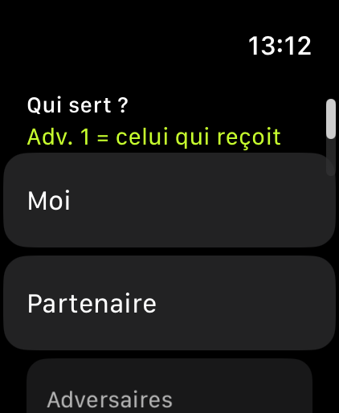

- **Simple** (en 3×15 ou en **5 points**, pour un petit match à trois en attendant un
  terrain) ou **double**.
- On indique qui sert. En double, une **convention** évite de demander le receveur :
  *Adv. 1, c'est celui qui reçoit le premier service* (ou qui le sert, si ce sont les
  adversaires qui commencent). Le rappel s'affiche à l'écran.

<br clear="right">

### Un tap par point

<p>
  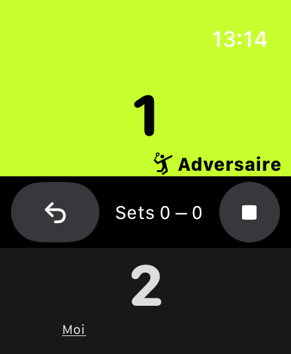
  &nbsp;
  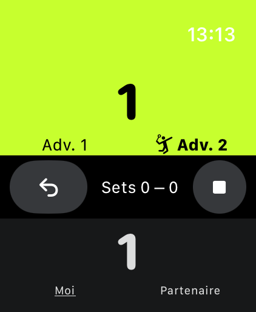
</p>

- **Moitié basse = mon point, moitié haute = le leur.** De grandes zones, pensées pour
  un doigt en sueur, et une vibration à chaque point pour ne pas avoir à regarder.
- **Le camp au service est en vert-jaune.** Chaque joueur est affiché **dans sa case,
  vu depuis ta place** : les adversaires sont en miroir, leur case gauche apparaît à ta
  droite. Le serveur est en gras avec l'icône, le receveur souligné.
- **↶ annule** le dernier point, sans limite. **■ arrête** le match (avec confirmation).

### Les règles, appliquées pour toi

<p>
  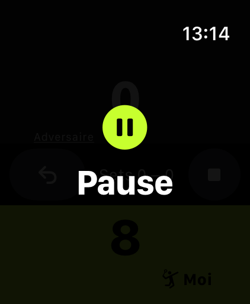
  &nbsp;
  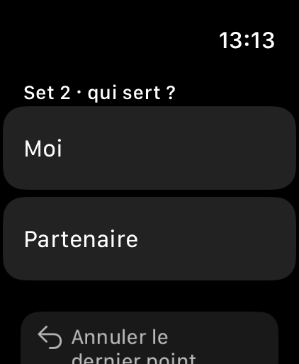
  &nbsp;
  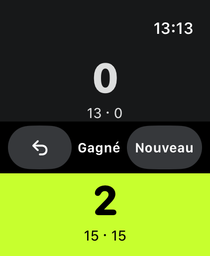
</p>

- **Format BWF 3×15** (en vigueur en France depuis septembre 2026) : sets de 15 points,
  2 points d'écart dès 14-14, plafond à 21, deux sets gagnants.
- **Rotation du service en double** : le camp qui sert et gagne permute ; le camp qui
  reçoit et gagne ne bouge pas, et sert depuis la case de la parité de son score.
- **Pause à 8 points** (avec changement de côté au 3e set), annoncée par une vibration
  et un message.
- **À chaque set**, l'app demande qui sert, parmi le camp qui a gagné le set précédent.
- **En fin de match**, le score de chaque set reste affiché.

### Rien ne se perd

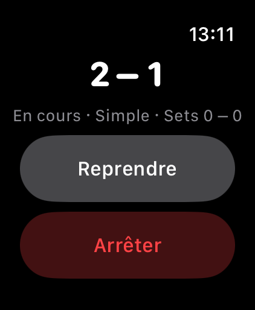

- **Chaque point est sauvegardé** sur la montre. Si l'app plante ou se ferme, le match
  est proposé à la reprise au lancement suivant.
- **Une séance « Badminton » Santé** tourne pendant le match : elle garde l'app à
  l'écran entre les échanges et enregistre calories et fréquence cardiaque.
- Les matchs en 5 points ne sont jamais sauvegardés : ils sont juste pour le fun.

<br clear="right">

## Sur l'iPhone

<p>
  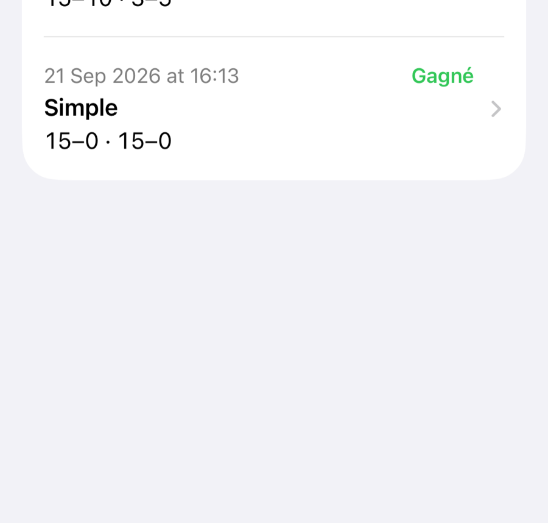
  &nbsp;
  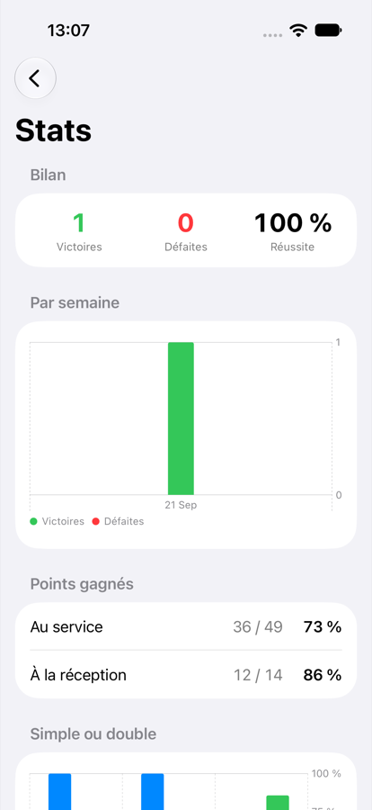
  &nbsp;
  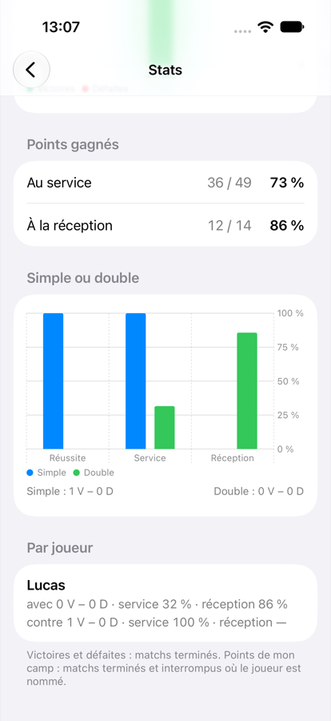
</p>

- **Historique** : chaque match terminé ou arrêté arrive tout seul depuis la montre,
  même si l'iPhone n'était pas à portée au moment du match. Glisser vers la gauche pour
  supprimer un match.
- **Noms après coup** : toucher un match pour nommer son partenaire et ses adversaires,
  si on s'en souvient. Les noms déjà utilisés sont proposés, et ils ne quittent jamais
  l'iPhone.
- **Stats** :
  - victoires, défaites et réussite ;
  - évolution par semaine ;
  - pourcentage de points gagnés au service et à la réception ;
  - simple contre double ;
  - bilan **par joueur** : avec lui et contre lui.

## Comment c'est construit

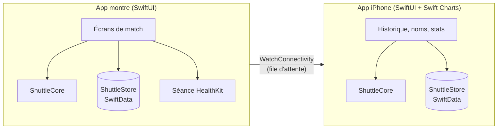

- **`ShuttleCore`** : toutes les règles métier, en Swift pur. Score, sets, rotation du
  service, positions, pause, sauvegarde, synchro, stats. Un match est un **journal
  d'échanges** : l'état (score, serveur, cases) est recalculé en le rejouant, ce qui rend
  l'annulation triviale et donne aux stats tout le détail point par point.
- **`ShuttleStore`** : la sauvegarde SwiftData, partagée par les deux apps.
- **`ShuttleScore/`** et **`ShuttleScorePhone/`** : les deux apps SwiftUI, aussi fines
  que possible.

Les règles détaillées, avec des exemples chiffrés, sont dans **[SPEC.md](SPEC.md)**.

## Développer

**Prérequis** : Xcode 27 et [XcodeGen](https://github.com/yonaskolb/XcodeGen)
(`brew install xcodegen`). Le projet Xcode est généré depuis `project.yml` et n'est pas
versionné.

```sh
make project      # génère ShuttleScore.xcodeproj (à relancer après un git pull)
open ShuttleScore.xcodeproj

make verify       # lint, build et tests unitaires (~15 s) : à lancer avant chaque commit
make app          # build des apps montre et iPhone sur simulateur
make ui-test      # tests de bout en bout de la montre (simulateur)
make ui-test-phone  # tests de bout en bout de l'iPhone (simulateur)
```

**La CI** (GitHub Actions) lance `verify`, puis le build et tous les tests UI, à chaque
push.

**Installer sur ses appareils** : l'app iPhone (schéma `ShuttleScorePhone`) s'installe
par câble. Avec un compte développeur gratuit, l'app montre doit être installée
**directement depuis Xcode** (schéma `ShuttleScore`, destination la montre) : watchOS
refuse de l'installer via l'iPhone. Les apps expirent au bout de 7 jours ; il suffit de
relancer ⌘R.
