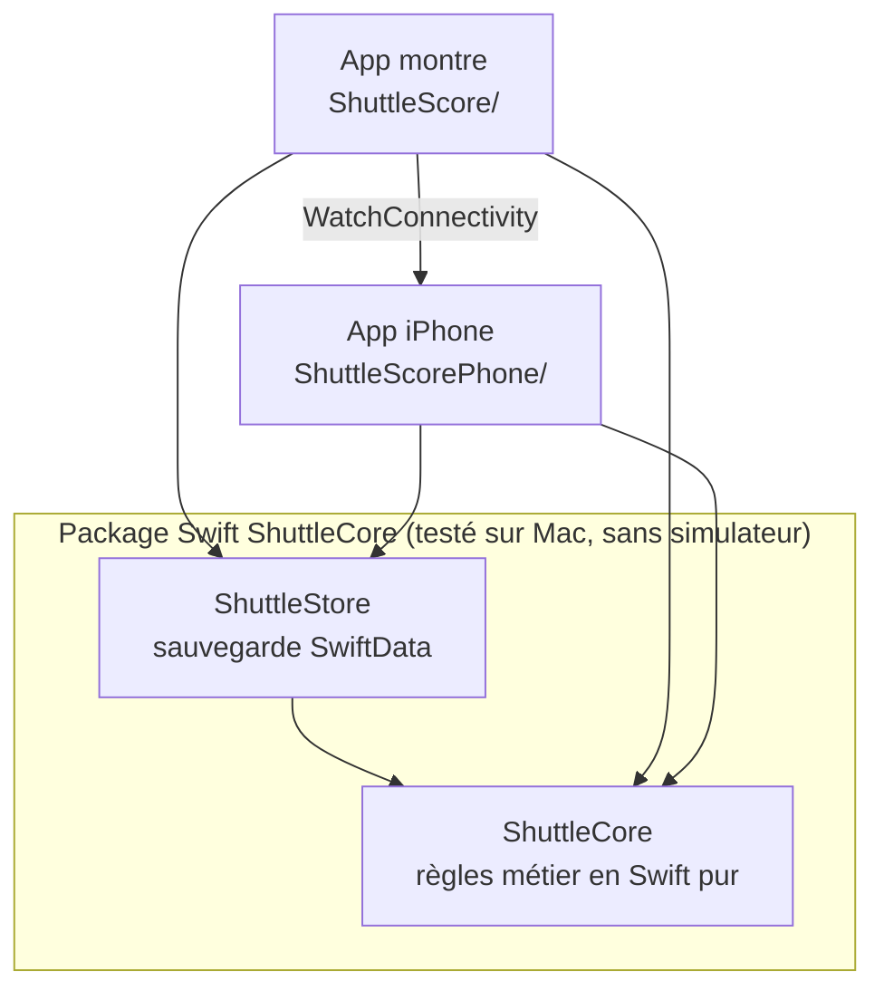

# Comment ShuttleScore est construit

Ce document suit le trajet d'**un point**, du tap sur la montre jusqu'aux graphiques de
l'iPhone, et explique au passage les briques utilisées. Il s'adresse notamment aux
développeurs web qui découvrent Swift et SwiftUI : les équivalences avec React sont
indiquées quand elles aident.

Les extraits de code sont tirés du dépôt. Certains sont raccourcis : ils le signalent par
`// …`.

## Vue d'ensemble



| Dossier | Rôle | Dépend de |
|---|---|---|
| `ShuttleCore/Sources/ShuttleCore` | Toutes les règles : score, sets, service, positions, pause, stats, noms | Rien (Swift + Foundation) |
| `ShuttleCore/Sources/ShuttleStore` | Sauvegarde des matchs avec SwiftData | ShuttleCore |
| `ShuttleScore/` | App montre : écrans de match, séance Santé, envoi à l'iPhone | ShuttleCore, ShuttleStore, HealthKit |
| `ShuttleScorePhone/` | App iPhone : historique, noms, stats | ShuttleCore, ShuttleStore, Swift Charts |

Le principe : **les règles ne savent rien des écrans**. `ShuttleCore` n'importe ni SwiftUI,
ni SwiftData, ni HealthKit. Il se teste donc en une quinzaine de secondes sur Mac
(`make verify`), et les deux apps se contentent d'afficher ce qu'il calcule.

## SwiftUI en cinq notions, pour qui connaît React

| SwiftUI | Équivalent React | Dans le projet |
|---|---|---|
| `struct … : View` avec une propriété `body` | Un composant fonction et ce qu'il retourne | `MatchView`, `HistoryView`… |
| `@State` | `useState` | Le match en cours dans `RootView` |
| `@Binding` | Une prop plus son setter (`value` + `onChange`) | `MatchView` reçoit le match en `@Binding` |
| `@Observable` sur une classe | Un petit store (Zustand, MobX) | `HistoryModel` côté iPhone |
| Modificateurs (`.padding()`, `.foregroundStyle()`…) | Le style et les props passés au composant | Partout |

Comme en React, une vue est une **fonction de son état** : on ne modifie pas l'écran, on
modifie l'état, et SwiftUI recalcule `body`. Différence notable : les `struct` Swift sont
des **valeurs** (copiées, pas partagées), ce qui rend les mutations explicites.

## 1. Le tap : une moitié d'écran, c'est un bouton

L'écran de match empile trois éléments : la moitié adverse, la barre centrale, et la
moitié du joueur. Chaque moitié est un `Button` qui occupe tout son espace
(`ShuttleScore/MatchView.swift`, raccourci) :

```swift
VStack(spacing: 0) {
    SideHalf(side: .opponent, format: match.format, rules: match.rules, state: state) {
        score(.opponent)
    }
    CenterBar(state: state, rules: match.rules, undo: undo, stop: { confirmsStop = true },
        onNewMatch: onNewMatch)
    SideHalf(side: .me, format: match.format, rules: match.rules, state: state) {
        score(.me)
    }
}
```

`VStack` correspond à un `flex-direction: column`. Le dernier argument entre accolades est
une **closure**, l'équivalent d'un `onClick={() => score("opponent")}`.

## 2. Le point s'ajoute au journal

Un match n'est pas un score qu'on incrémente : c'est un **journal d'événements**, comme une
liste d'actions Redux. `recordRally` ajoute un échange au journal
(`ShuttleCore/Sources/ShuttleCore/Match.swift`) :

```swift
public mutating func recordRally(wonBy side: Side, at date: Date = Date()) {
    let current = state
    guard !current.isOver, current.awaitingServiceChoice == nil else { return }
    log.append(LoggedEvent(event: .rally(wonBy: side), at: date))
}
```

`mutating` signale qu'une méthode modifie la `struct` (une valeur). `guard … else
{ return }` est un early return : un point est ignoré si le match est fini ou si le
service du set reste à choisir.

## 3. Le score est recalculé en rejouant le journal

Le score, le serveur, la case de chacun et l'annonce de pause ne sont **jamais stockés**.
La propriété `state` rejoue le journal à chaque lecture, comme un `reduce` sur une liste
d'actions (raccourci) :

```swift
public var state: MatchState {
    var completedGames: [GameScore] = []
    var game = GameScore(me: 0, opponent: 0)
    var rotation: Rotation? = Rotation(firstService, format: format)
    // …
    for event in events {
        switch event {
        case .serviceChoice(let choice):
            rotation = Rotation(choice, format: format)
        case .rally(let side):
            game[side] += 1
            rotation?.rallyWon(by: side, newScore: game[side])
            guard rules.isGameWon(game, by: side) else { continue }
            completedGames.append(game)
            game = GameScore(me: 0, opponent: 0)
            // …
        }
    }
    // …
}
```

Ce choix a trois conséquences :

- **Annuler** revient à retirer la dernière entrée du journal (`log.popLast()`). Il n'y a
  aucun état à « défaire ».
- **Aucun état incohérent** n'est possible : tout découle du journal.
- **Les stats** disposent du détail de chaque échange (gagnant, serveur, heure), parce que
  c'est exactement ce qui est sauvegardé.

Les règles du badminton vivent dans de petits types dédiés, comme `Rotation`, qui suit qui
occupe la case droite de chaque camp et applique la rotation du service en double. Les
règles de comptage (15 points, plafond 21, pause à 8…) sont des paramètres
(`ScoringRules`) : le format « 5 points » n'est qu'un autre jeu de valeurs.

## 4. L'écran se met à jour, et chaque changement est sauvegardé

Côté montre, la vue racine garde le match en `@State` et le passe à `MatchView` sous forme
de `Binding` personnalisé. Son setter fait deux choses : mettre à jour l'état, puis
prévenir le `MatchRecorder` qui sauvegarde (`ShuttleScore/ShuttleScoreApp.swift`) :

```swift
let binding = Binding(
    get: { current },
    set: {
        match = $0
        recorder.matchChanged($0)
    })
```

En React, ce serait un `onChange={(m) => { setMatch(m); recorder.matchChanged(m) }}`. Le
`MatchRecorder` (dans `ShuttleCore`, donc testé) décide quoi faire : sauvegarder le match
en cours, le marquer terminé, ne jamais garder un 5 points, envoyer le match à l'iPhone
quand il est fini…

Il ne connaît pas SwiftData : il parle à un **protocole** `MatchStore` (l'équivalent
d'une interface TypeScript). L'app lui donne le vrai stockage SwiftData ; les tests lui
donnent un faux en mémoire.

## 5. La sauvegarde : un match entier en JSON

`ShuttleStore` range chaque match dans SwiftData. Le match complet (règles, service,
journal horodaté) est encodé en JSON grâce au protocole `Codable`, l'équivalent d'un
`JSON.stringify` / `JSON.parse` typé. Quelques champs à côté (statut, date, format)
servent à trier et filtrer sans décoder.

Au lancement, si un match était `en cours` (plantage, app fermée), l'app propose de le
reprendre.

## 6. La séance Santé garde l'app à l'écran

Sans séance d'entraînement active, watchOS remet le cadran au bout de quelques secondes.
L'app ouvre donc une séance « Badminton » HealthKit pendant le match. Là encore, la
décision (quand démarrer, mettre en pause, terminer, récupérer une séance après un
plantage) est dans `ShuttleCore` (`WorkoutTracker`, testé avec un faux), et seule la
classe `HealthKitWorkoutSession` de l'app parle à HealthKit.

## 7. Le match part vers l'iPhone

À la fin d'un match, la montre l'envoie par **WatchConnectivity**
(`ShuttleScore/WatchConnectivitySync.swift`) :

```swift
func send(_ message: SyncMessage) {
    guard let data = try? message.encoded() else { return }
    if isActivated {
        WCSession.default.transferUserInfo([SyncKey.message: data])
    } else {
        pending.append(data)
    }
}
```

`transferUserInfo` met le message en **file d'attente** : s'il n'y a pas d'iPhone à portée,
le système l'enverra plus tard, même si l'app est fermée. Côté iPhone,
`PhoneConnectivity` reçoit le message et le passe au `MatchSyncReceiver` de `ShuttleCore`,
qui l'enregistre dans le stockage de l'iPhone.

## 8. L'iPhone recalcule historique et stats

L'app iPhone tient un `HistoryModel` marqué `@Observable` : quand ses propriétés changent,
les vues qui les lisent se redessinent, comme avec un store. Recharger, c'est relire le
stockage et tout recalculer avec `ShuttleCore` :

```swift
func reload() {
    let history = (try? store?.history()) ?? []
    names = (try? store?.allNames()) ?? [:]
    // …
    summaries = history.map(MatchSummary.init)
    stats = MatchStats(history)
    playerRecords = MatchStats.byPlayer(history, names: names)
}
```

Les graphiques utilisent **Swift Charts**, une bibliothèque déclarative proche de
Recharts : on décrit des « marques » (barres, lignes), et le framework s'occupe des axes et
de la légende.

## Les tests

| Niveau | Où | Ce qui est prouvé | Durée |
|---|---|---|---|
| Unitaires | `ShuttleCore/Tests/ShuttleCoreTests` | Toutes les règles : sets, rotation du double avec les exemples de la spec, positions, pause, sauvegarde, synchro, stats, noms | ~1 s |
| Stockage | `ShuttleCore/Tests/ShuttleStoreTests` | SwiftData : relecture, relance de l'app, migration du format | ~1 s |
| Bout en bout, montre | `ShuttleScoreUITests` | Parcours réels sur simulateur : jouer, annuler, double, pause, reprise après fermeture de l'app | ~10 min |
| Bout en bout, iPhone | `ShuttleScorePhoneUITests` | Historique, suppression, noms, stats | ~8 min |

`make verify` lance les deux premières lignes, avant chaque commit. La CI (GitHub
Actions) lance tout, à chaque push. Les captures d'écran du README sont produites par les
tests de bout en bout.

Le détail des règles, avec des exemples chiffrés, est dans [SPEC.md](../SPEC.md).
